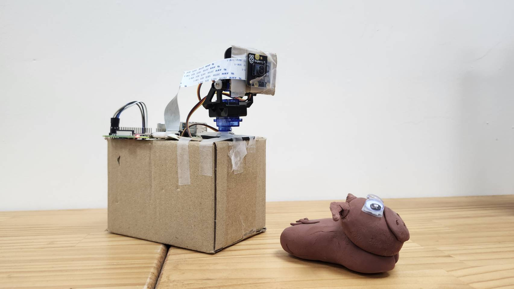

# ESC final project - Moomentcatcher: 樹莓派雲台相機系統 (Pan-Tilt Camera System)

Slide: https://canva.link/fwrqwje1162h372

這個專案使用 Raspberry Pi 搭配 PCA9685 伺服馬達驅動板與 Picamera2 模組，結合 OpenCV 實現了「全景人臉捕捉」與「即時人臉追蹤」雙模式的雲台相機系統。

## 檔案功能說明

### 1. 全景捕捉模式 (主要功能) - `panorama.py`
雲台會依照預設的矩陣角度（Pan: 80°~100°, Tilt: 100°~115°）進行自動掃描與拍攝。
* 拍攝後會立即進行 OpenCV 臉部特徵辨識。
* 若畫面中存在人臉，將自動保存影像至 `panorama_output` 資料夾。
* 拍攝流程結束後，會透過 `rsync` 將成果自動同步至遠端主機（例如另一台 Pi 5）。

### 2. 即時人臉追蹤模式 (擴充功能) - `face_tracking.py`
提供即時的視覺互動功能。
* 透過 OpenCV `haarcascade_frontalface_default.xml` 模型即時鎖定畫面中最大的人臉。
* 運用簡易 P-control (比例控制) 計算人臉與畫面中心的誤差值。
* 即時驅動 Pan/Tilt 伺服馬達，讓相機鏡頭持續「盯」著目標移動。

---

## Installation

本專案建議使用 Python 虛擬環境來隔離依賴套件。請在樹莓派終端機執行以下指令：

**1. 建立並啟動虛擬環境 (允許使用系統套件)**
```bash
python3 -m venv --system-site-packages .venv
source .venv/bin/activate
```

**2. 安裝核心相機與硬體控制套件**

```bash
sudo apt update
sudo apt install python3-picamera2
pip3 install adafruit-circuitpython-pca9685
pip3 install adafruit-circuitpython-motor
```

**3. 安裝影像處理與追蹤套件**

```bash
pip install numpy==1.23.5
pip install opencv-python==4.7.0.72
pip install imutils
pip install dlib-20.0.1-cp311-cp311-linux_aarch64.whl
```
---

## Usage

請確保已經連接好 PCA9685 (I2C) 以及相機模組，並在執行前確認虛擬環境已啟動 `(.venv)`。

**執行全景捕捉：**

```bash
python3 panorama.py
```

**執行即時追蹤：**

```bash
python3 face_tracking.py
```


